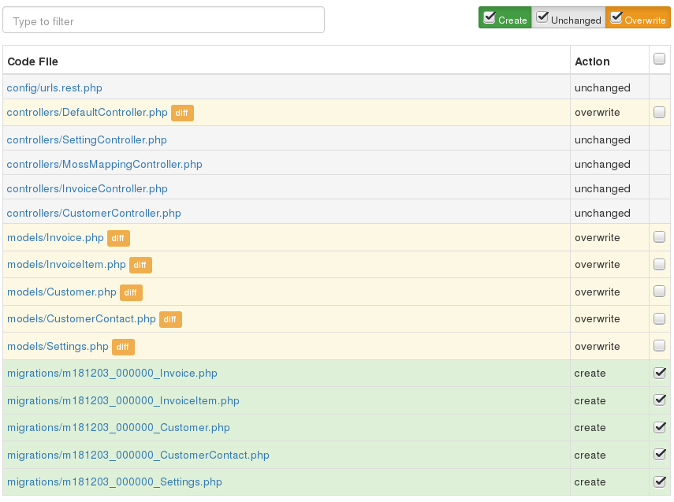

# yii2-openapi

REST API application generator for Yii2, openapi 3.0 YAML -> Yii2.

Base on [Gii, the Yii Framework Code Generator](https://www.yiiframework.com/extension/yiisoft/yii2-gii).

[](https://packagist.org/packages/cebe/yii2-openapi)
[](https://packagist.org/packages/cebe/yii2-openapi)
[](https://packagist.org/packages/cebe/yii2-openapi)
[](https://packagist.org/packages/cebe/yii2-openapi)


## TLDR; what is this?

A code generator for OpenAPI and Yii Framework based PHP API application.

Input: [OpenAPI 3.0 YAML or JSON](https://github.com/OAI/OpenAPI-Specification#the-openapi-specification) (via [cebe/php-openapi](https://github.com/cebe/php-openapi))

Output: Yii Framework Application with Controllers, Models, database schema


## Features

Currently available features:

- Generate Path mappings, **Controllers** and Actions **for API Endpoints**. CRUD Endpoints are ready-to-use, other Endpoints are generated as abstract functions that need to be implemented
- Generate **Models** and validation based on OpenAPI Schema
- Generate **Database Schema** from OpenAPI Schema
- Generates **Database Migrations** for schema changes
- Provide **Dummy Data** via Faker for development

## Requirements

- PHP 7.1 or higher (works fine with PHP 8)


## Install

    composer require cebe/yii2-openapi:^2.0@beta

## Usage

You can use this package in your existing application or start a new project using the
[yii2-app-api](https://github.com/cebe/yii2-app-api) application template.
For usage of the template, see instructions in the template repo readme.

In your existing Yii application config (works for console as well as web):

```php
<?php
$config = [
    // ... this is your application config ...
];

if (YII_ENV_DEV) {
    // enable Gii module
    $config['bootstrap'][] = 'gii';
    $config['modules']['gii'] = [
        'class' => \yii\gii\Module::class,
        'generators' => [
            // add ApiGenerator to Gii module
            'api' => \cebe\yii2openapi\generator\ApiGenerator::class,

            // --------- OR ---------
            // to disable generation of migrations files or with default config change
            'api' => [
              'class' => \cebe\yii2openapi\generator\ApiGenerator::class,
              'generateMigrations' => false, # this config can also be applied in CLI command
            ],
        ],
    ];
}

return $config;
```

To use the web generator, open `index.php?r=gii` and select the `REST API Generator`.

On console you can run the generator with `./yii gii/api --openApiPath=@app/openapi.yaml`. Where `@app/openapi.yaml` should be the absolute path to your OpenAPI spec file. This can be JSON as well as YAML (see also [cebe/php-openapi](https://github.com/cebe/php-openapi/) for supported formats).

Run `./yii gii/api --help` for all options. Example: Disable generation of migrations files `./yii gii/api --generateMigrations=0`

See [Petstore example](https://github.com/OAI/OpenAPI-Specification/blob/main/examples/v3.0/petstore.yaml) for example OpenAPI spec.


## OpenAPI extensions

This library understands the following extensions to the OpenAPI spec:

### `x-faker`

You may specify custom PHP code for generating fake data for a property:

```yaml
    Post:
      properties:
        id:
          type: integer
        tags:
          type: array
          items:
            type: string
          example: ['one', 'two']
          x-faker: "$faker->randomElements(['one', 'two', 'three', 'four'])"
```

To avoid generating faker code for particular model attribute, use value `false`:

```yaml
    Post:
      properties:
        age:
          type: integer
          x-faker: false
```

Using in reference with `allOf`:

```yaml
    Invoice:
      type: object
      required:
        - id
      properties:
        id:
          type: integer

    Order:
      type: object
      required:
        - id
      properties:
        id:
          type: integer
        invoice:
          allOf:
            - $ref: '#/components/schemas/Invoice'
            - x-faker: false
```

### `x-table`

Specify the table name for a Schema that defines a model which is stored in the database.
You can generate non-db model based on \yii\base\Model without migrations by setting `x-table: false`

### `x-pk`

Explicitly specify primary key name for table, if it is different from "id" 

```yaml
    Post:
      x-table: posts
      x-pk: uid
      properties:
        uid:
           type: integer
        title:
           type: string
```

### `x-db-type`

Explicitly specify the database type for a column. (MUST contain only real DB type! (`json`, `jsonb`, `uuid`, `varchar` etc.)).
If `x-db-type` is set to `false`, property will be processed as virtual;
It will be added in model as public property, but skipped for migrations generation.

Example values of `x-db-type` are:

 - `false` (boolean false)
 - as string and its value can be like:
     - text
     - text[]
     - INTEGER PRIMARY KEY AUTO_INCREMENT
     - decimal(12,4)
     - json
     - varchar
     - VARCHAR
     - SMALLINT UNSIGNED ZEROFILL
     - MEDIUMINT(10) UNSIGNED ZEROFILL COMMENT "comment" (note the double quotes here)

Such values are not allowed:
   - `int null default null after low_price` (null and default will be handled by `nullable` and `default` keys respectively)
   - MEDIUMINT(10) UNSIGNED ZEROFILL NULL DEFAULT '7' COMMENT 'comment' AFTER `seti`, ADD INDEX `t` (`w`)

If `enum` and `x-db-type` both are provided then for database column schema (migrations), only `x-db-type` will be considered ignoring `enum`.

### `x-indexes`

Specify table indexes

```yaml
    Post:
      x-table: posts
      x-indexes:
          - 'visible,publish_date'
          - 'unique:title' #for unique attributes also unique validation check will be added
          - 'gist:metadata' #for postgres will generate index using GIST index type
      properties:
        id:
           type: integer
           x-db-type: INTEGER PRIMARY KEY AUTO_INCREMENT
        title:
           type: string
        visible:
            type: boolean
        publish_date:
            type: string
            format: date
        metadata:
           type: object
           x-db-type: JSON
           default: '{}' 
```

### `x-db-default-expression`

Ability to provide default value by database expression

```yaml
created_at:
  readOnly: true
  type: string
  format: datetime
  x-db-type: datetime
  nullable: false
  x-db-default-expression: current_timestamp()
```

Note: If both `default` and `x-db-default-expression` are present then `default` will be considered.

```yaml
created_at:
  readOnly: true
  type: string
  format: datetime
  x-db-type: datetime
  nullable: false
  x-db-default-expression: current_timestamp() # this will be ignored
  default: "2011-11-11" # this will be considered
```

Also see: https://dev.mysql.com/doc/refman/8.0/en/data-type-defaults.html

### `x-fk-on-delete`

Allow to set foreign key constraint in migrations for ON DELETE event of row in database table. Example:

```yaml
  components:
    schemas:
      User:
        type: object
        description: x on-x (update|delete) foreign key constraint
        properties:
          id:
            type: integer
          name:
            type: string
      Post:
        type: object
        description: x on-x (update|delete) foreign key constraint
        properties:
          id:
            type: integer
          title:
            type: string
          user:
            allOf:
              - $ref: '#/components/schemas/User'
              - x-fk-on-update: CASCADE
          user_2:
            allOf:
              - $ref: '#/components/schemas/User'
              - x-fk-on-update: CASCADE
              - x-fk-on-delete: SET NULL
          user_3:
            allOf:
              - $ref: '#/components/schemas/User'
              - x-fk-on-delete: SET NULL
          user_4:
            $ref: '#/components/schemas/User' # without any constraints
```

### `x-fk-on-update`

Allow to set foreign key constraint in migrations for ON UPDATE event of row in database table. For example, see above section for `x-fk-on-delete`.

### `x-fk-column-name`

Provide custom database table column name in case of relationship column. This will not reflect in models relations, faker etc. Example:

```yaml
  components:
    schemas:
      Webhook:
        type: object
        description: example for x-fk-column-name
        properties:
          id:
            type: integer
          name:
            type: string
          user:
            $ref: '../openapi.yaml#/components/schemas/User' # this will automatically create `user_id` column
          redelivery_of:
            allOf:
              - $ref: '../openapi.yaml#/components/schemas/Delivery'
              # this will automatically create `redelivery_of_id` column, but to avoid that use below extension
              - x-fk-column-name: redelivery_of # this will create `redelivery_of` column instead of `redelivery_of_id`
```

## Many-to-Many relation definition

There are two ways for define many-to-many relations:

### Simple many-to-many without junction model

   - property name for many-to-many relation should be equal lower-cased, pluralized related schema name
     
   - referenced schema should contains mirrored reference to current schema
     
   - migration for junction table can be generated automatically - table name should be [pluralized, lower-cased
 schema_name1]2[pluralized, lower-cased schema name2], in alphabetical order;
 For example, for schemas Post and Tag - table should be posts2tags, for schemas Post and Attachement - table should
  be attachments2posts
  
```
Post:
  properties:
  ...
    tags:
      type: array
      items:
        $ref: '#/components/schemas/Tag'

Tag:
  properties:
  ...
    posts:
      type: array
      items:
        $ref: '#/components/schemas/Post'
```
  
### Many-to-many with junction model

This way allowed creating multiple many-to-many relations between to models 

- define junction schema with all necessary attributes. There are only one important requirement - the junction
 schema name
 must be started with prefix 'junction_' (This prefix will be used internally only and
 will be trimmed before table and model generation)
 
```
# Model TeamMembers with table team_members will be generated with columns team_id, user_id and role
junction_TeamMembers:
   team:
      $ref: '#/components/schemas/Team'
   user:
      $ref: '#/components/schemas/User'
   role:
     type: string
```
- Both many-to-many related schemas must have properties with reference to "junction_*" schema. These properties will be
 used as relation names 

```
Team:
  properties:
  ...
     team_members:
       type: array
       items:
         $ref: '#/components/schemas/junction_TeamMembers'

User:
  properties:
  ...
    memberships: #You absolutely free with naming for relationship attributes
      type: array
      items:
        $ref: '#/components/schemas/junction_TeamMembers'
```
  
 - see both examples here [tests/specs/many2many.yaml](tests/specs/many2many.yaml)
 

## Handling of `NOT NULL` constraints

`NOT NULL` in DB migrations is determined by `nullable` and `required` properties of the OpenAPI schema.
e.g. attribute = 'my_property'.

- If you define attribute neither "required" nor via "nullable", then it is by default `NULL`:

```yaml
  ExampleSchema:
    properties:
      my_property:
        type: string
```

- If you define attribute in "required", then it is `NOT NULL`

```yaml
  ExampleSchema:
    required:
     - my_property
    properties:
      my_property:
        type: string
```

- If you define attribute via "nullable", then it overrides "required", e.g. allow `NULL` in this case:

```yaml
  ExampleSchema:
    required:
      - my_property
    properties:
      my_property:
        type: string
        nullable: true
```

- If you define attribute via "nullable", then it overrides "required", e.g. `NOT NULL` in this case:

```yaml
  test_table:
    required:
    properties:
      my_property:
        type: string
        nullable: false
```

## Handling of `enum` (#enum)
It works on all 3 DB: MySQL, MariaDb and PgSQL.

 ```yaml
  test_table:
    properties:
      my_property:
        enum:
          - one
          - two
          - three
```

Note: Changes in enum values are not very simple. For Mysql and Mariadb, migrations will be generated but in many cases custom modification in it are required. For Pgsql migrations for change in enum values will not be generated. It should be handled manually.

It will be ignored for database column schema (migrations) if `x-db-type` is provided.

## Handling of `numeric` (#numeric, #MariaDb)

precision-default = 10
scale-default = 2

- You can define attribute like "numeric(precision,scale)":
 ```yaml
  test_table:
    properties:
      my_property:
        x-db-type: decimal(12,4)
```
DB-Result = decimal(12,4)

- You can define attribute like "numeric(precision)" with default scale-default = 2:
 ```yaml
  test_table:
    properties:
      my_property:
        x-db-type: decimal(12)
```
DB-Result = decimal(12,2)

- You can define attribute like "numeric" with precision-default = 10 and scale-default = 2:
 ```yaml
  test_table:
    properties:
      my_property:
        x-db-type: decimal
```
DB-Result = decimal(10,2)

## Handling of `timestamp` database column data type

If field is defined as

```yaml
created_at:
    type: string
    format: date-time # or datetime
    example: '2020-03-14T21:42:17Z'
    readOnly: true
```

then database type selected will be `timestamp`. This is by design. If `datetime` data type is needed, use `x-db-type` as

```yaml
created_at:
    type: string
    format: date-time # or datetime
    example: '2020-03-14T21:42:17Z'
    x-db-type: datetime
    readOnly: true
```

## Assumptions

When generating code from an OpenAPI description there are many possible ways to achive a fitting result.
Thus there are some assumptions and limitations that are currently applied to make this work.
Here is a (possibly incomplete) list:

- The current implementation works best with OpenAPI description that follows the [JSON:API](https://jsonapi.org/) guidelines.
  - The request and response format/schema is currently not extracted from OpenAPI schema and may need to be adjusted manually if it does not follow JSON:API
- column/field/property with name `id` is considered as Primary Key by this library and it is automatically handled by DB/Yii; so remove it from validation `rules()`
  - other fields can currently be used as primary keys using the `x-pk` OpenAPI extension (see below) but it may not be work correctly in all cases, please report bugs if you find them.

Other things to keep in mind:

### Adding columns to existing tables

When adding new fields in the API models, new migrations will be generated to add these fields to the table.
For a project that is already in production, it should be considered to adjust the generated migration to add default
values for existing data records.

One case where this is important is the addition of a new column with `NOT NULL` contraint, which does not provide a default value.
Such a migration will fail when the table is not empty:

```php
$this->addColumn('{{%company}}', 'name', $this->string(128)->notNull());
```

Fails on a PostgreSQL database with

> add column name string(128) NOT NULL to table {{%company}} ...Exception: SQLSTATE[23502]: Not null violation: 7 ERROR:  column "name" contains null values

The solution would be to create the column, allowing NULL, set the value to a default and add the null constraint later.

```php
$this->addColumn('{{%company}}', 'name', $this->string(128)->null());
$this->update('{{%company}}', ['name' => 'No name']);
$this->alterColumn('{{%company}}', 'name', $this->string(128)->notNull());
```

## Screenshots

Gii Generator Form:


Generated files:




# Development

To contribute or play around, steps to set up this project up locally are in [CONTRIBUTING.md](./CONTRIBUTING.md).


# Support

**Need help with your API project?**

Professional support, consulting as well as software development services are available:

https://www.cebe.cc/en/contact

Development of this library is sponsored by [cebe.:cloud: "Your Professional Deployment Platform"](https://cebe.cloud).
